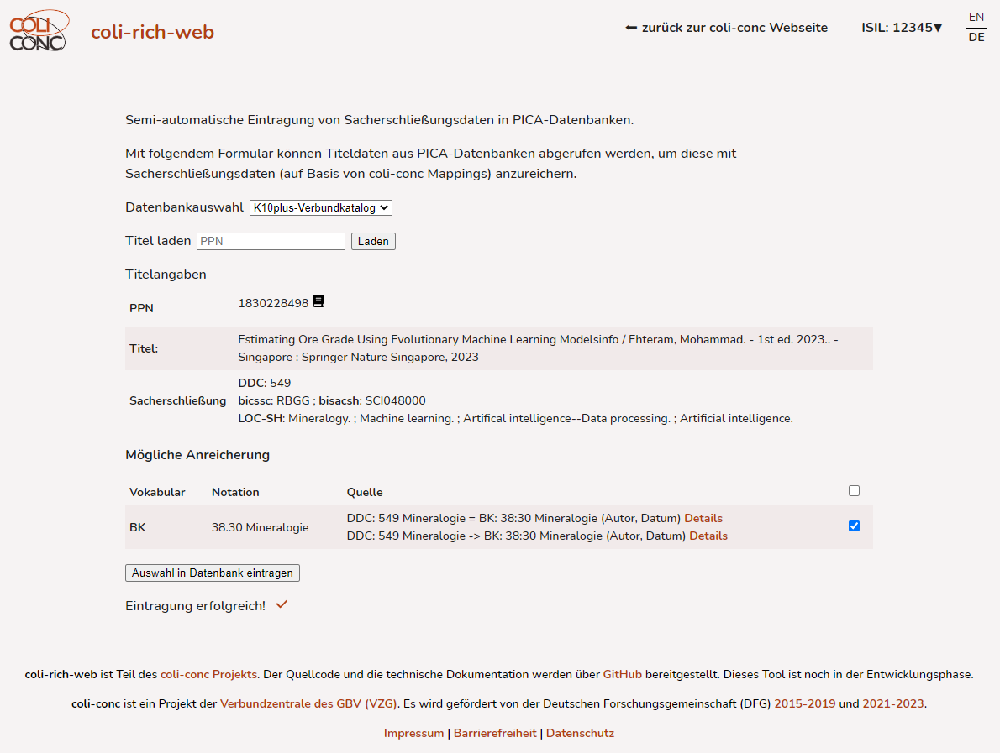

# coli-rich Web Interface
Webanwendung zur Anreicherung von Sacherschließungsdaten auf Grundlage von Mappings

## To-Dos

- [ ] Code cleanup
  - [ ] Split App.vue into multiple components
  - [ ] Simplify code where necessary
  - [ ] Separate configuration
- [x] Add loading spinners (and separate loading indication for different phases)
- [x] Check if Docker container works as expected
- [x] Deploy demo to coli-conc.gbv.de: https://coli-conc.gbv.de/coli-rich/dev/
- [ ] Write README
- [ ] Add more examples?
- [ ] Fix concept data for Wikidata, STW, ...
- [ ] Add favicon
